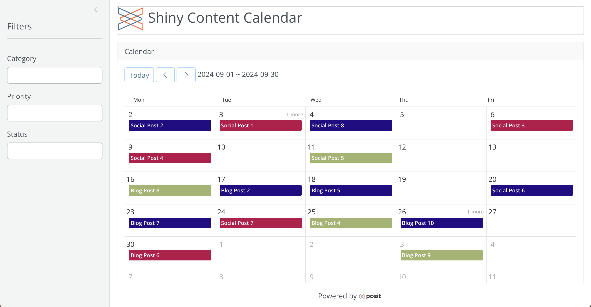

# Shiny Calendar

## End-to-End Workflow with Posit Team presentation, August 2024

*Using pins for Shiny with ever-changing data*

Welcome to the GitHub repository for the project showcased in Posit's "End-to-End Workflow with Posit Team" webinar in August 2024. This project includes a Shiny content calendar that automatically updates with the latest Jira project API data.

* [Event invite](https://pos.it/team-demo) - *Happening August 28, 2024 at 11am ET*
* [Slides](https://connect.posit.cloud/ivelasq/content/0191902f-f29f-7d83-3606-3d3a013e33d5)
    * [GitHub Repo for Slides](https://github.com/ivelasq/automated-quarto-dashboards-slides)
* [Calendar link](https://pub.demo.posit.team/public/shiny-calendar/)
* [Pin link](https://pub.demo.posit.team/public/shiny-calendar-pin/)
* [Data pull QMD](https://pub.demo.posit.team/public/shiny-calendar-data-pull/)

## Useful links

### Shiny and reactivity

* [Basic reactivity in Mastering Shiny](https://mastering-shiny.org/basic-reactivity.html#reactive-programming)
* [Understanding reactivity on the Shiny site](https://shiny.posit.co/r/articles/build/understanding-reactivity/)

### Posit professional products

* [Posit Team](https://posit.co/products/enterprise/team/)
* [Scheduling on Posit Connect](https://docs.posit.co/connect/user/scheduling/)
* [Deploying data for content on Connect](https://solutions.posit.co/connections/deploying-data/index.html#special-considerations-for-shiny-apps)

### Packages

* [pins::pin_reactive_read()](https://pins.rstudio.com/reference/pin_reactive_read.html)
* [bslib](https://rstudio.github.io/bslib/)
* [toastui](https://dreamrs.github.io/toastui/)

### Additional links

* [End-to-end workflows with Posit Team playlist](https://www.youtube.com/playlist?list=PL9HYL-VRX0oRsUB5AgNMQuKuHPpNDLBVt)